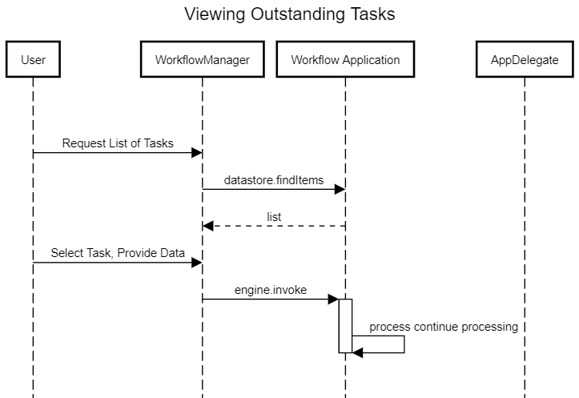

# Workflow as a Service
In this document, we discuss how to integrate your application with bpmn-server as a Service.

We assume that you are already familiar with setting up bpmn-server along with your processes and having them running.

Please note code in this page is for illustration purposes only.

We have two major Applications here, [AppServer](#appServer) and [WorflowServer](#WorkflowServer)

## AppServer
This is your standard Business Application providing various tiers/layers including a UI and Business logic

This app requires 'bpmn-client'

In this Application we will designate a class to handle workflow functions, namely 'WorkflowManager'

```javascript
requires 'bpmn-client';

class WorkflowManager
{
	/**
		from your business logic you decide to issue invoice
	*/
	startInvoice(data)
	{
		var response= await getServer().engine.start('invoice',data,null,userId,{noWait: true});
		...
	}
	/**
		from UI you want to show to the user list of outstanding invoices that need approval
		
	*/
	listDueTasks()
	{
	var items= await getServer().datastore.findInstances({'items.elementId'='Approve','items.status'='wait'});
	
	}
	/**
		as a result of ListDueTasks, your app will provide a UI Form for user input
		
	**/
	approveInvoice(data)
	{
		/**
		this will invoke (complete) that item the user have selected and pass any data
		**/
		var response= await getServer().engine.invoke({'items.id': data.itemId},data,userId,{noWait: true});
	}

}

```

## WorkflowServer

This is your custom installation of bpmn-server 

###	AppDelegate

This is your custom logic to support bpmn-server processes

```javascript
requires 'bpmn-server';

class MyAppDelegate extends DefaultAppDelegate{
{
	/**
		This is the EventHandler, receives a notification on every event

		issue a notification (email) to appropriate user(s) when a process reaches a User Task
		
	*/
	async executionEvent(context, event) {

		if (context.item) {
			if (event == 'wait' && context.item.element.type == 'bpmn:UserTask')
			{
				 msg=`Notification for '#{context.definition.name}' CaseId: #{context.instance.data.caseId}
						Item '#{context.item.elementId}' now has the status of '#{context.item.status}';
		
				console.log(msg);
			}
		}
	}
		
	}
```
# Putting it Togother

## Use Case 1: Starging a Process
In this use case a User invokes some business logic that requires a process start ...
When a process reaches a User Task it issues a notification to user(s).


## Use Case 2: Viewing Oustatnding Tasks



