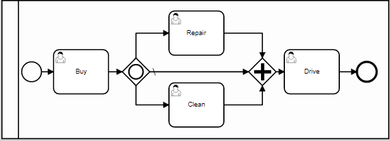

# Buy Used Car Example:



For the model above we will walk-through how to execute it programaticaly.

## Using bpmn-server Server Class


```javascript
const { configuration }  = require('../configuration.js');
const { BPMNServer, Logger } = require('bpmn-server');

const logger = new Logger({ toConsole: true });

test();

async function test() {

    const server = new BPMNServer(configuration, logger);

    const engine = server.engine;

```
The server object provides a set of components;for now, we need the engine
We start a process execution by name; in this case 'Buy Used Car' 
BPMN definitions are saved our catalog as defined by the [configuration](../setup.md), in our WebApp they are under WebApp/processes folder

```javascript
    let response = await engine.start('Buy Used Car');

```
    the above will go through all the bpmn elements and pause at our User Task 

    let us get the items; items are the instances of various nodes executed so far


```javascript

    const items = response.items.filter(item => {
        return (item.status == 'wait');
    });

    items.forEach(item => {
        console.log(`  waiting for <${item.name}> -<${item.elementId}> id: <${item.id}> `);
    });
    const itemId = items[0].id;

    console.log(`Invoking Buy id: <${itemId}>`);

```
We now need to specify which node to invoke, keep in mind this can happen any time later
so we need to identify the instance as well as the item, but since the ItemId is unique we can use it for the query.

The [query](../query.md) is passed to MongoDB to select the appropriate item.
   
```javascript

    const input={ model: 'Thunderbird', needsRepairs: false, needsCleaning: false };
    response = await engine.invoke({items: { id: itemId } }, input );

    console.log("Ready to drive");

```
    keeping in mind that the bpmn definition defines conditional flow as such:

```javascript

    <bpmn:sequenceFlow id="flow_gw1_clean" sourceRef="gateway_1" targetRef="task_clean">
      <bpmn:conditionExpression xsi:type="bpmn:tExpression"><![CDATA[
      (this.needsCleaning=="Yes")
      ]]></bpmn:conditionExpression>
    </bpmn:sequenceFlow>

```

    in the next step, we will query on instance id as well as the element id 

```javascript
    response = await engine.invoke({ instance: { response.execution.id }, items: {elementId: 'task_Drive' }});

    console.log(`that is it!, process is now complete status=<${response.execution.status}>`)

}

```
The instance Items should look like this:


