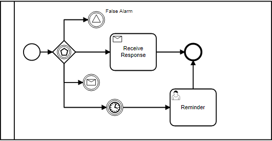
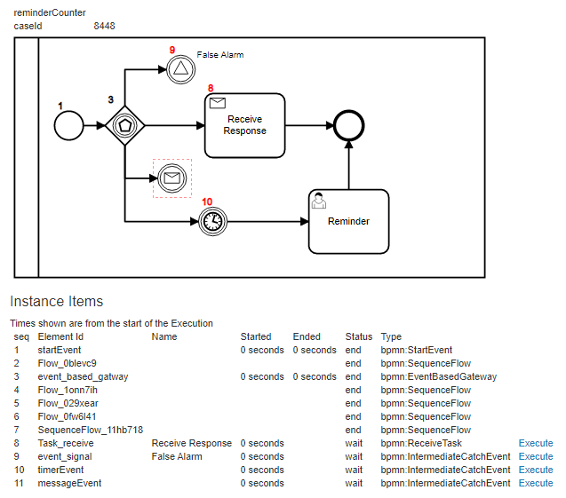
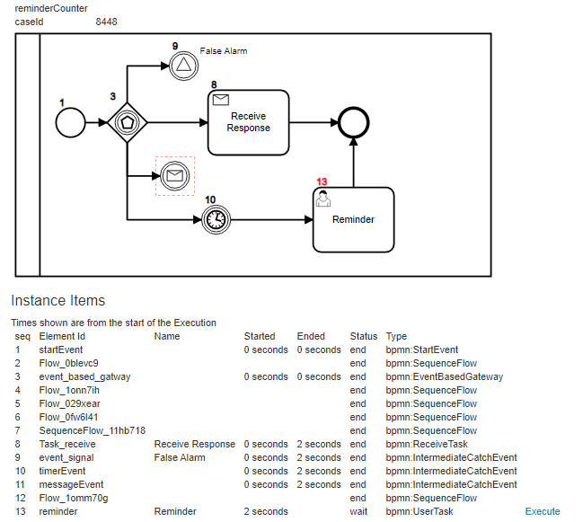

# Event Based Gateway:



Event Based Gateway launches all valid outbound flows, but once on event is completed, it must cancel the rest.

```javascript

const { BPMNServer , DefaultHandler , Logger } = require("../../");
const { configuration } = require('../../configuration');


const logger = new Logger({ toConsole: false });

const server = new BPMNServer(configuration, logger);

let name = 'Event Based Gateway';

let process;
let response;
let instanceId;

Feature('Event Based Gateway', () => {

        Scenario('All', () => {

            Given('Start Process', async () => {
                response = await server.engine.start(name, { reminderCounter: 0, caseId: 1005 });
            });
            Then('events should fire and wait', () => {

                expect(response).to.have.property('execution');
                instanceId = response.execution.id;
                expect(getItem('timerEvent').status).equals('wait');
                expect(getItem('messageEvent').status).equals('wait');
                expect(getItem('Task_receive').status).equals('wait');
                expect(getItem('event_signal').status).equals('wait');

            });
```
to visualize the process, let us borrow from the WebApp


    ```javascript
            When('we wait a bit for timer to complete', async () => {
                server.cron.checkTimers();
                await delay(3000, 'test');

                // we restore to get latest status; since the timer did some work in the background!

                response = await server.engine.get({ "id": instanceId });
            });

            Then('after wait - timer should have completed', () => {
                expect(getItem('timerEvent').status).equals('end');
            });
            and('other events complete as well', () => {
                expect(getItem('messageEvent').status).equals('end');
                expect(getItem('Task_receive').status).equals('end');
                expect(getItem('event_signal').status).equals('end');
            });

            and('also reminder task will fire', () => {
                expect(getItem('reminder').status).equals('wait');
            });
```
again, let us see what it looks like now!
//

    ```javascript

            When('we issue reminder', async () => {

                const query = { id: instanceId ,"items.elementId": 'reminder' };
                response=await server.engine.invoke(query, {});
            });
      
            and('write log file to' + name + '.log', async () => {
              let fileName = __dirname + '/../logs/' + name+ '.log';
              logger.save(fileName);
            });

        });

}); 
async function delay(time) {
    log("delaying ... " + time)
    return new Promise(function (resolve) {
        setTimeout(function () {
            log("delayed is done.");
            resolve();
        }, time);
    });
}
function log(msg) {
    logger.log(msg);
}
function getItem(id)
{
    const item = response.items.filter(item => { return item.elementId == id; })[0]
    if (!item) {
        log('item ' + id + ' not found');
    }
    return item;
}

```
